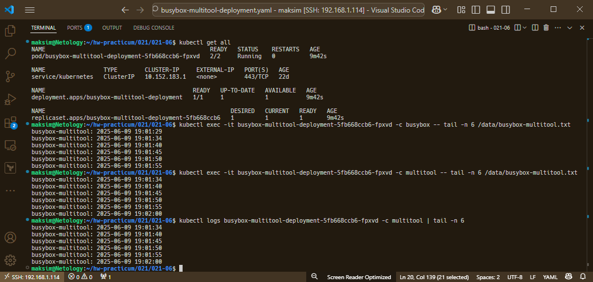
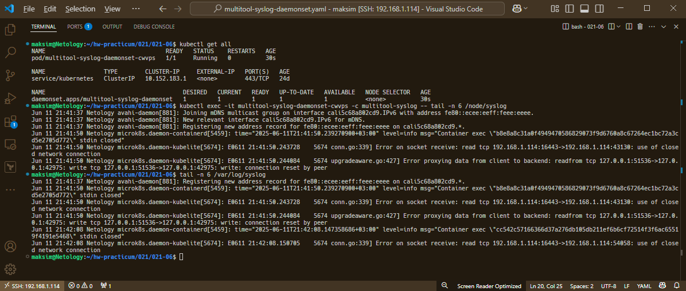

# Домашнее задание к занятию «Хранение в K8s. Часть 1»

### Цель задания

В тестовой среде Kubernetes нужно обеспечить обмен файлами между контейнерам пода и доступ к логам ноды.

------

### Чеклист готовности к домашнему заданию

1. Установленное K8s-решение (например, MicroK8S).
2. Установленный локальный kubectl.
3. Редактор YAML-файлов с подключенным GitHub-репозиторием.

------

### Дополнительные материалы для выполнения задания

1. [Инструкция по установке MicroK8S](https://microk8s.io/docs/getting-started).
2. [Описание Volumes](https://kubernetes.io/docs/concepts/storage/volumes/).
3. [Описание Multitool](https://github.com/wbitt/Network-MultiTool).

------

### Задание 1 

**Что нужно сделать**

Создать Deployment приложения, состоящего из двух контейнеров и обменивающихся данными.

1. Создать Deployment приложения, состоящего из контейнеров busybox и multitool.
2. Сделать так, чтобы busybox писал каждые пять секунд в некий файл в общей директории.
3. Обеспечить возможность чтения файла контейнером multitool.
4. Продемонстрировать, что multitool может читать файл, который периодоически обновляется.
5. Предоставить манифесты Deployment в решении, а также скриншоты или вывод команды из п. 4.

### Ответ 1

#### Манифест

[busybox-multitool-deployment.yaml](./files/busybox-multitool-deployment.yaml)

#### Список используемых команд

```bash
# Выводим информацию обо всех ресурсах Kubernetes в текущем namespace:
$ kubectl get all

# Контейнер busybox, содержимое файда /data/busybox-multitool.txt
$ kubectl exec -it busybox-multitool-deployment-5fb668ccb6-fpxvd -c busybox -- tail -n 6 /data/busybox-multitool.txt

# Контейнер multitool, содержимое файла /data/busybox-multitool.txt
$ kubectl exec -it busybox-multitool-deployment-5fb668ccb6-fpxvd -c multitool -- tail -n 6 /data/busybox-multitool.txt

# Логи контейнер multitool
$ kubectl logs busybox-multitool-deployment-5fb668ccb6-fpxvd -c multitool | tail -n 6
```

#### Скриншот вывода команд



------

### Задание 2

**Что нужно сделать**

Создать DaemonSet приложения, которое может прочитать логи ноды.

1. Создать DaemonSet приложения, состоящего из multitool.
2. Обеспечить возможность чтения файла `/var/log/syslog` кластера MicroK8S.
3. Продемонстрировать возможность чтения файла изнутри пода.
4. Предоставить манифесты Deployment, а также скриншоты или вывод команды из п. 2.

### Ответ 2

#### Манифест

[multitool-syslog-daemonset.yaml](./files/multitool-syslog-daemonset.yaml)

#### Список используемых команд

```bash
# Выводим информацию обо всех ресурсах Kubernetes в текущем namespace:
$ kubectl get all

# Контейнер multitool-syslog, содержимое файда /node/syslog
$ kubectl exec -it multitool-syslog-daemonset-cwvps -c multitool-syslog -- tail -n 6 /node/syslog

# Кластер MicroK8S, содержимое файла /var/log/syslog
$ tail -n 6 /var/log/syslog
```

#### Скриншот вывода команд



------

### Правила приёма работы

1. Домашняя работа оформляется в своём Git-репозитории в файле README.md. Выполненное задание пришлите ссылкой на .md-файл в вашем репозитории.
2. Файл README.md должен содержать скриншоты вывода необходимых команд `kubectl`, а также скриншоты результатов.
3. Репозиторий должен содержать тексты манифестов или ссылки на них в файле README.md.

------
