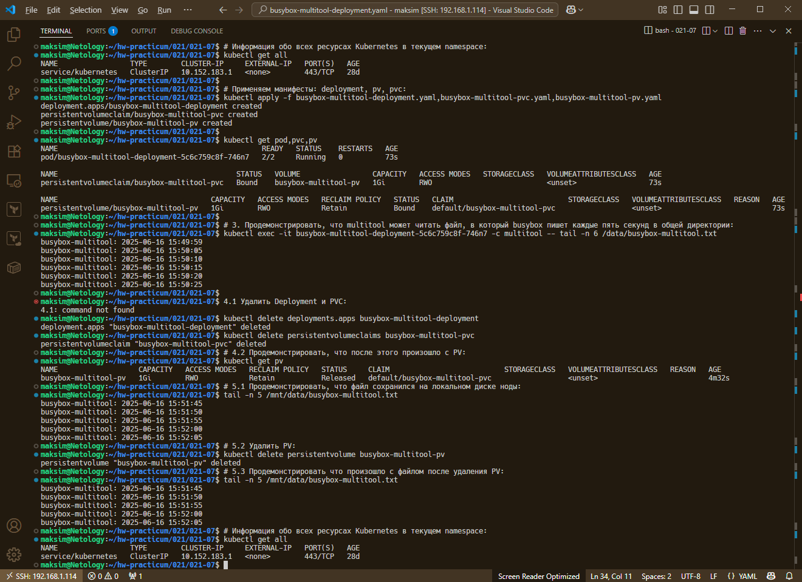
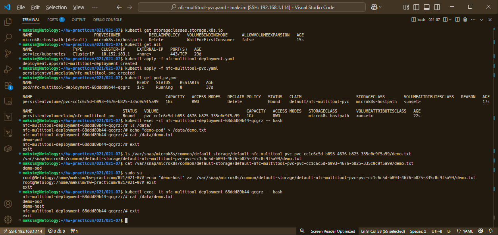

# Домашнее задание к занятию «Хранение в K8s. Часть 2»

### Цель задания

В тестовой среде Kubernetes нужно создать PV и продемострировать запись и хранение файлов.

------

### Чеклист готовности к домашнему заданию

1. Установленное K8s-решение (например, MicroK8S).
2. Установленный локальный kubectl.
3. Редактор YAML-файлов с подключенным GitHub-репозиторием.

------

### Дополнительные материалы для выполнения задания

1. [Инструкция по установке NFS в MicroK8S](https://microk8s.io/docs/how-to-nfs). 
2. [Описание Persistent Volumes](https://kubernetes.io/docs/concepts/storage/persistent-volumes/). 
3. [Описание динамического провижининга](https://kubernetes.io/docs/concepts/storage/dynamic-provisioning/). 
4. [Описание Multitool](https://github.com/wbitt/Network-MultiTool).

------

### Задание 1

**Что нужно сделать**

Создать Deployment приложения, использующего локальный PV, созданный вручную.

1. Создать Deployment приложения, состоящего из контейнеров busybox и multitool.
2. Создать PV и PVC для подключения папки на локальной ноде, которая будет использована в поде.
3. Продемонстрировать, что multitool может читать файл, в который busybox пишет каждые пять секунд в общей директории. 
4. Удалить Deployment и PVC. Продемонстрировать, что после этого произошло с PV. Пояснить, почему.
5. Продемонстрировать, что файл сохранился на локальном диске ноды. Удалить PV.  Продемонстрировать что произошло с файлом после удаления PV. Пояснить, почему.
5. Предоставить манифесты, а также скриншоты или вывод необходимых команд.

### Ответ 1

#### Манифесты

##### Deployment

[busybox-multitool-deployment.yaml](./files/busybox-multitool-deployment.yaml)

##### PV

[busybox-multitool-pv.yaml](./files/busybox-multitool-pv.yaml)

##### PVC

[busybox-multitool-pvc.yaml](./files/busybox-multitool-pvc.yaml)

#### Список используемых команд

```bash
# Информация обо всех ресурсах Kubernetes в текущем namespace:
$ kubectl get all

# Применяем манифесты: deployment, pv, pvc:
$ kubectl apply -f busybox-multitool-deployment.yaml,busybox-multitool-pvc.yaml,busybox-multitool-pv.yaml 

# Информация о ресурсах:
$ kubectl get pod,pvc,pv

# 3. Продемонстрировать, что multitool может читать файл, в который busybox пишет каждые пять секунд в общей директории:
$ kubectl exec -it busybox-multitool-deployment-5c6c759c8f-746n7 -c multitool -- tail -n 6 /data/busybox-multitool.txt

# 4.1 Удалить Deployment и PVC:
$ kubectl delete deployments.apps busybox-multitool-deployment 
$ kubectl delete persistentvolumeclaims busybox-multitool-pvc 

# 4.2 Продемонстрировать, что после этого произошло с PV:
$ kubectl get pv

# 5.1 Продемонстрировать, что файл сохранился на локальном диске ноды:
maksim@Netology:~/hw-practicum/021/021-07$ tail -n 5 /mnt/data/busybox-multitool.txt

# 5.2 Удалить PV:
$ kubectl delete persistentvolume busybox-multitool-pv

# 5.3 Продемонстрировать что произошло с файлом после удаления PV:
$ tail -n 5 /mnt/data/busybox-multitool.txt
```

#### Скриншот вывода команд



#### Пояснения

После удаления Deployment и PVC статус PV сменился с Bound на Released, т.к. [Reclaim policy -  https://kubernetes.io/docs/concepts/storage/storage-classes/#reclaim-policy](https://kubernetes.io/docs/concepts/storage/storage-classes/#reclaim-policy) в статусе `Retain` и PV переходит в Released и ждёт ручного управления. Если бы [Reclaim policy](https://kubernetes.io/docs/concepts/storage/storage-classes/#reclaim-policy) был в статусе `Delete` (`persistentVolumeReclaimPolicy: Delete`) - PV автоматически удалился бы вместе с PVC.

Удаление PV не влияет на локальную директорию - не удаляет и не изменяет её, т.к. `persistentVolumeReclaimPolicy: Retain`. Подробно в документации K8s: [Storage Object in Use Protection](https://kubernetes.io/docs/concepts/storage/persistent-volumes/#storage-object-in-use-protection).

------

### Задание 2

**Что нужно сделать**

Создать Deployment приложения, которое может хранить файлы на NFS с динамическим созданием PV.

1. Включить и настроить NFS-сервер на MicroK8S.
2. Создать Deployment приложения состоящего из multitool, и подключить к нему PV, созданный автоматически на сервере NFS.
3. Продемонстрировать возможность чтения и записи файла изнутри пода. 
4. Предоставить манифесты, а также скриншоты или вывод необходимых команд.

### Ответ 2

Изучил [инструкцию по установке NFS в MicroK8S](https://microk8s.io/docs/how-to-nfs). В рамках обучения исползовал сильно простой вариант, в MicroK8s активировал `hostpath-storage`, который автоматически создаёт тома на ноде, т.е. MicroK8s автоматически создаст PV при запросе от PVC (storageClassName: "microk8s-hostpath"    # <-- добавлен в манифесте PVC).

#### Манифесты

##### Deployment

[nfc-multitool-deployment.yaml](./files/nfc-multitool-deployment.yaml)

##### PVC

[nfc-multitool-pvc.yaml](./files/nfc-multitool-pvc.yaml)

#### Список используемых команд

```bash
# Включаем hostpath-storage в MicroK8s
$ microk8s enable hostpath-storage

# Проверяем доступные StorageClass в кластере
$ kubectl get storageclasses.storage.k8s.io

# Информация обо всех ресурсах Kubernetes в текущем namespace:
$ kubectl get all

# Применяем манифесты: deployment, pvc:
$ kubectl apply -f nfc-multitool-deployment.yaml
$ kubectl apply -f nfc-multitool-pvc.yaml

# Информация о ресурсах (автоматически созданный PV):
$ kubectl get pod,pv,pvc

# Далее демонстрация записи внутри пода, на ноде файл будет здесь:
/var/snap/microk8s/common/default-storage/multitool-pvc-*/demo.txt

```

#### Скриншот вывода команд



------

### Правила приёма работы

1. Домашняя работа оформляется в своём Git-репозитории в файле README.md. Выполненное задание пришлите ссылкой на .md-файл в вашем репозитории.
2. Файл README.md должен содержать скриншоты вывода необходимых команд `kubectl`, а также скриншоты результатов.
3. Репозиторий должен содержать тексты манифестов или ссылки на них в файле README.md.
