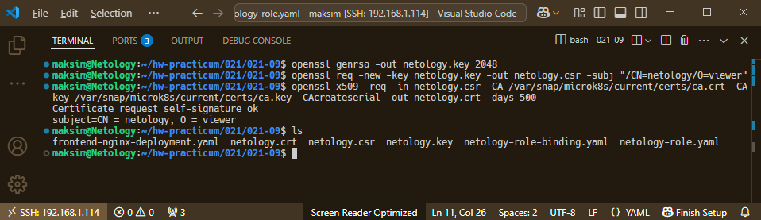
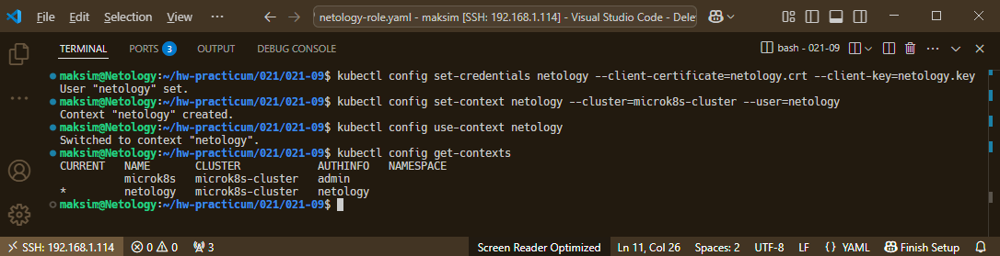
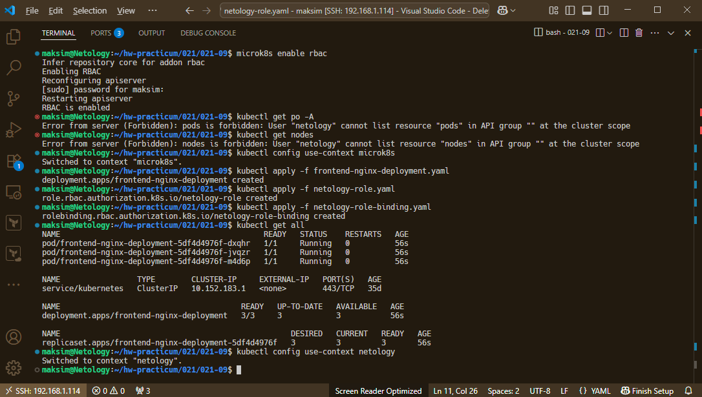
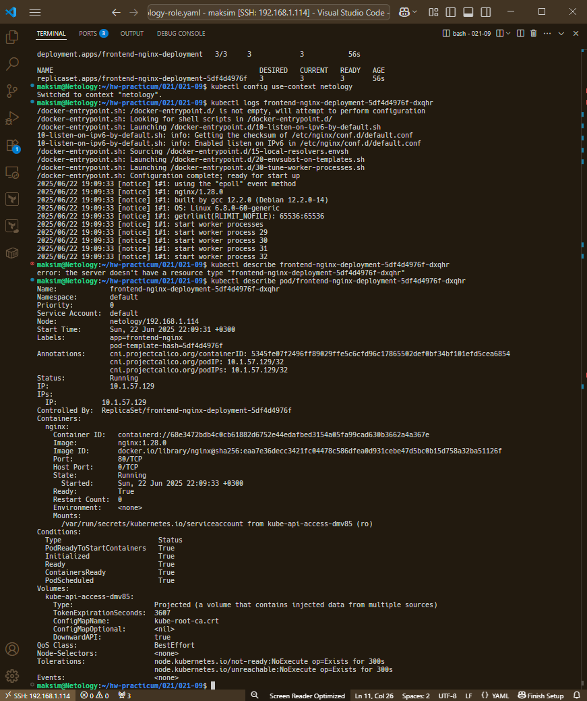

# Домашнее задание к занятию «Управление доступом»

### Цель задания

В тестовой среде Kubernetes нужно предоставить ограниченный доступ пользователю.

------

### Чеклист готовности к домашнему заданию

1. Установлено k8s-решение, например MicroK8S.
2. Установленный локальный kubectl.
3. Редактор YAML-файлов с подключённым github-репозиторием.

------

### Инструменты / дополнительные материалы, которые пригодятся для выполнения задания

1. [Описание](https://kubernetes.io/docs/reference/access-authn-authz/rbac/) RBAC.
2. [Пользователи и авторизация RBAC в Kubernetes](https://habr.com/ru/company/flant/blog/470503/).
3. [RBAC with Kubernetes in Minikube](https://medium.com/@HoussemDellai/rbac-with-kubernetes-in-minikube-4deed658ea7b).

------

### Задание 1. Создайте конфигурацию для подключения пользователя

1. Создайте и подпишите SSL-сертификат для подключения к кластеру.
2. Настройте конфигурационный файл kubectl для подключения.
3. Создайте роли и все необходимые настройки для пользователя.
4. Предусмотрите права пользователя. Пользователь может просматривать логи подов и их конфигурацию (`kubectl logs pod <pod_id>`, `kubectl describe pod <pod_id>`).
5. Предоставьте манифесты и скриншоты и/или вывод необходимых команд.

### Ответ 1

#### Манифесты

1. [netology-role.yaml](./files/netology-role.yaml)
2. [netology-role-binding.yaml](./files/netology-role-binding.yaml)
3. [frontend-nginx-deployment.yaml](./files/frontend-nginx-deployment.yaml)

#### Список используемых команд и скриншоты вывода

**Создайте и подпишите SSL-сертификат для подключения к кластеру:**

```bash
# Создаём приватный ключ `netology.key`:
$ openssl genrsa -out netology.key 2048

# Создание `netology.csr` (запрос на подписание сертификата) на основе `netology.key`:
$ openssl req -new -key netology.key -out netology.csr -subj "/CN=netology/O=viewer"

# Создаём и подписываем пользовательский сертификат `netology.crt` корневым сертификатом и ключом Kubernetes (CA) для выдачи пользовательского сертификата `netology.crt` на 500 дней. `netology.csr` берём как заявку на выпуск "пользовательского" сертификата:
$ openssl x509 -req -in netology.csr -CA /var/snap/microk8s/current/certs/ca.crt -CAkey /var/snap/microk8s/current/certs/ca.key -CAcreateserial -out netology.crt -days 500
```



**Настройте конфигурационный файл kubectl для подключения:**

```bash
# Добавляем пользователя netology в kubeconfig:
$ kubectl config set-credentials netology --client-certificate=netology.crt --client-key=netology.key

# Создаём новый контекст с именем netology, контекст связывает пользователя netology с кластером microk8s-cluster:
$ kubectl config set-context netology --cluster=microk8s-cluster --user=netology

# Переключаем текущий контекст на netology, все последующие команды kubectl будут выполняться от этого пользоывтеля:
$ kubectl config use-context netology

# Выводим все доступные контексты в kubeconfig:
$ kubectl config get-contexts
```



**Создайте роли и все необходимые настройки для пользователя:**

```bash
# Ограничим доступ пользователю включив RBAC, изначально не включен в microk8s и увидим что доступа нет:
$ microk8s enable rbac
$ kubectl get po -A
$ kubectl get nodes

# Переключимся обратно на админа:
$ kubectl config use-context microk8s

# Создадим для нашего пользователя netology Role, RoleBinding и Deployment:
$ kubectl apply -f netology-role.yaml
$ kubectl apply -f netology-role-binding.yaml
$ kubectl apply -f frontend-nginx-deployment.yaml

# Переключаемся на пользователя netology:
$ kubectl config use-context netology
```



**Пользователь может просматривать логи подов и их конфигурацию (`kubectl logs pod <pod_id>`, `kubectl describe pod <pod_id>`):**

```bash
$ kubectl logs pod/frontend-nginx-deployment-5df4d4976f-dxqhr
$ kubectl describe pod/frontend-nginx-deployment-5df4d4976f-dxqhr
```



------

### Правила приёма работы

1. Домашняя работа оформляется в своём Git-репозитории в файле README.md. Выполненное домашнее задание пришлите ссылкой на .md-файл в вашем репозитории.
2. Файл README.md должен содержать скриншоты вывода необходимых команд `kubectl`, скриншоты результатов.
3. Репозиторий должен содержать тексты манифестов или ссылки на них в файле README.md.

------

